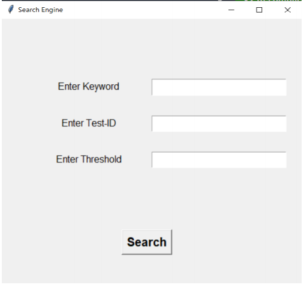
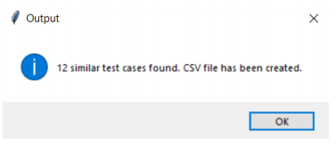
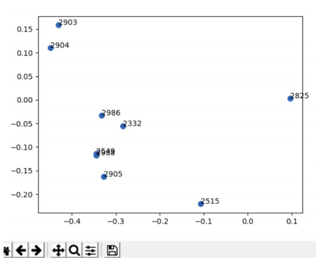

# Impact_analysis

## Introduction

Impact analysis of software change leveraging ML, NLP models from huge number of test cases and requirement documents written in English – Python , Tensorflow / ElMo or equivalent model

## Architecture and Flow

## Preprocessing

Pre-Processing of Data - Data preprocessing is done to make the text in a form that can be used to analyze and predict the task. A task can be extracting text or keywords from the data file or sentiment analysis or checking sentence similarity. A large number of test cases written in english in a doc file need to be pre-processed before feeding into the model.

## USE Model Testing

The USE model provides better similarity index as compared to other models (ELMO, BERT). A simple example showing the cosine similarity using USE model is as follows:

---

## Usage of the tool:

1. Download the [USE](https://tfhub.dev/google/universal-sentence-encoder-large/5) model. 

2. Zip file named **5.tar** will be downloaded **(Please do not change this name)**

3. Clone the Github Repository [Impact Analysis](https://github.com/SoniSiddharth/Impact_analysis)

4. Create a new folder named **model_use** in **code_files** and extract all the files of the 5.tar in **model_use**.

5. Create two folders named: **separate_test_doc** & **main_document** in folder **code_files**. 

6. To create the first embeddings of the test cases - 
  - Run the `python3 automate_cre.py`.
  
  - Place the document file containing the test cases (SampleTestCases.docx) in the **main_document** folder and terminate the process by selecting Ctrl+C, a file named **mainfile.data** will be created and then run `python3 embeddings_update.py`.
  
  - After getting the message “saved”, check for the 2 “.npz files” (“embeddings.npz” and “id.npz”) in the folder where all the python files have been saved.
  
  - Search through the document: run the `python3 search_engine.py`. 
  
  - The console will ask for the user to enter either a keyword or a test-id.
  
  - Then, it will ask the user to set up a threshold value. Enter the threshold value in the range of 0-1. 
  
  - If the given keyword is not found as per the threshold value, the tool will ask if the user still wants to search some similar matching test-cases (y/n). If yes, then type ‘y’ and enter. 
  
  - After the search is completed, you will get the csv file containing the output of the search. The name of the file will be of the format: **Similar_to_SearchedString.csv”**
  
  - To search for both test-id and keyword, you can run `python3 keyword+testid.py` and enter the input values asked in the command line.

## GUI working

1. Run `python3 main_GUI.py` (it will take some time in the first time due to loading the model) then you can enter only keyword or only test-id or both. Provide the threshold value as per the need. You can also set the Default threshold value for all the three cases by editing the **threshold.csv** file.

## Output and plot

2. To get a graph plot, run `python3 graph_plot.py`. Enter the test-id for which you want to get the nearest test cases and press ENTER. The threshold value can be changed by editing the **threshold.csv** file. A new graph plot will be shown on the screen along with their test-ids. 

---

## To update/modify the test cases

- If your test cases are in two or more .docx files then there are two steps you can follow:

  1. Delete the existing doc file from the **main_document** and save it somewhere. Run `python3 automate_cre.py` and place all the doc files ONE BY ONE (copying one file and pasting it and repeating the same procedure for all the files) in the **main_document** folder.
  
  2. Merge all the doc files (along with the existing one) in a single doc file and after deleting the existing doc file from **main_document**, run  `python3 automate_cre.py` and place the Merged doc file in the **main_document** folder.

- Now after doing any one of the above steps, terminate the **automate_cre.py** and run `python3 embeddings_update.py`. You will get a message of embeddings getting saved.
